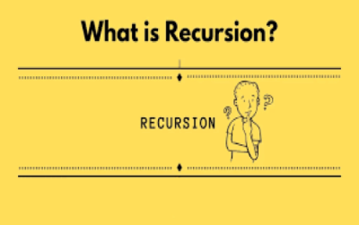
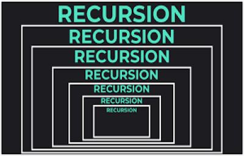
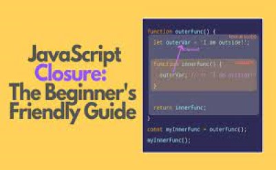

# <b style = "margin-left:270px">RECURSION</b>   

<b style = "margin-left:150px"></b>

### <b><i> Рекурсия — это когда функция вызывает сама себя, пока кто-то ее не остановит. Если никто это не остановит, то так и будет. рекурсия (вызов самого себя) навсегда. Рекурсивные функции позволяют выполнять единицу работы несколько раз.</i></b>

### В информатике рекурсия — это метод решение вычислительной задачи, решение которой зависит от решения более мелких экземпляров одной и той же задачи. вызывающие сами себя из собственного кода. Этот подход можно применить ко многим типам задач, а рекурсия является одной из центральных идей информатики.функции с помощью рекурсивные проблемы Рекурсия решает такие

### Сила рекурсии, очевидно, заключается в возможности определить бесконечное множество объектов с помощью конечного утверждения. Точно так же бесконечное число вычислений может быть описано конечной рекурсивной программой, даже если эта программа не содержит явных повторений.

<b style = "margin-left:150px"></b>

### <i>Большинство компьютерных языков программирования поддерживают рекурсию, позволяя функции вызывать себя из собственного кода.</i>

### Неоднократный вызов функции изнутри самой себя может привести к тому, что размер стека вызовов будет равен сумме входных размеров всех участвующих звонки. Отсюда следует, что для задач, которые можно легко решить путем итерации, рекурсия, как правило, менее эффективна, а для некоторых задач применяются алгоритмические методы или методы оптимизации компилятора. такая как оптимизация хвостового вызова, может повысить производительность вычислений по сравнению с наивной рекурсивной реализацией.

### Рекурсивная функция должна иметь условие, позволяющее прекратить вызов самой себя. В противном случае функция вызывается бесконечно. Как только условие выполнено, функция перестает вызывать сама себя. Это называется база состояние. Чтобы предотвратить бесконечную рекурсию, вы можете использовать оператор if...else (или аналогичный подход) где одна ветвь выполняет рекурсивный вызов, а другая нет       

# <b style = "margin-left:300px">CLOSURE</b>   

<b style = "margin-left:150px"></b>

### Замыкание — это комбинация функции, объединенной (заключенной) со ссылками на окружающее его состояние (лексическая среда). Другими словами, замыкание дает вам доступ к области внешней функции из внутренней функции

### JavaScript – язык с сильным функционально-ориентированным уклоном. Он даёт нам много свободы. Функция может быть динамически создана, скопирована в другую переменную или передана как аргумент другой функции и позже вызвана из совершенно другого места.

### Мы знаем, что функция может получить доступ к переменным из внешнего окружения, эта возможность используется очень часто.

### Но что произойдёт, когда внешние переменные изменятся? Функция получит последнее значение или то, которое существовало на момент создания функции?

### И что произойдёт, когда функция переместится в другое место в коде и будет вызвана оттуда – получит ли она доступ к внешним переменным своего нового местоположения?

> function sayHiBye(firstName, lastName) { 
> // функция-помощник, которую мы используем ниже  
> function getFullName() { 
> return firstName + " " + lastName; 
> }  > 
> consol.log( "Hello, " + getFullName() ); 
> consol.log( "Bye, " + getFullName() );  > 
> }  

### Несмотря на простоту этого примера, немного модифицированные его варианты применяются на практике, например, в генераторе псевдослучайных чисел и во многих других случаях.

### <i> Когда на собеседовании фронтенд-разработчику задают вопрос: «что такое замыкание?», – правильным ответом будет определение замыкания и объяснения того факта, что все функции в JavaScript являются замыканиями, и, может быть, несколько слов о технических деталях: свойстве [[Environment]] и о том, как работает лексическое окружение. </i>
